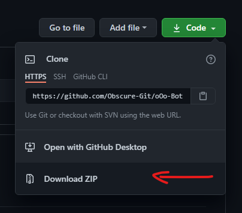

#  

oOo is an open source Discord bot coded in [discord.py](https://discordpy.readthedocs.io/en/latest/) by [Obscure.](https://github.com/Obscure-Git)
Feel free to add a star ⭐ to the repository to promote the project!

#### Table of contents

• [Features](https://github.com/Obscure-Git/oOo-Bot#features)

• [Installation](https://github.com/Obscure-Git/oOo-Bot#installation)

• [Links](https://github.com/Obscure-Git/oOo-Bot#links)

• [License](https://github.com/Obscure-Git/oOo-Bot#license)

• [Contribution](https://github.com/Obscure-Git/oOo-Bot#contribution)

• [Special Thanks](https://github.com/Obscure-Git/oOo-Bot#special-thanks)

# Features
oOo bot is updated and mainainted on a weekly basis. In addition to that we are also adding new and exiciting features to the bot in a weekly manner. Default prefix: `+`

### List

oOo currently offers:

• ✉️ Active Support regarding the bot in our [support server](https://discord.gg/s2khsve).

• ⚙️ Guild Configuration (custom prefixes).

• 😀 Commands made pleasant with use of embeds and minimal colors and relative emojis.

• 😂 Fast & Responsive memes and various content pulled from some of the most popular subreddits.

oOo also actively accepts feature requests in discussions tab or in our [support server](https://discord.gg/s2khsve).

### Commands

oOo has many commands and they are maintained properly.

**Some of them are:**

• 👻 **Fun:** `memes`, `meirl`, `slap`, `punch`, `poke`

• 🎮 **Mini games:** `rps`, `8ball`, `toss/flip`, `roll`

• ⚙️ **Utility:** `quickpolls`, `would you rather polls`, `advanced polls`, `setprefix`

• 👑 **Owner:** `loadcogs`, `unloadcogs`

[See full commands list](https://obot.gitbook.io/docs/)

# Installation

### Non Customized version

If you don't want to edit the code of the bot, a permanent 24/7 online version is available, which you can invite to your own Discord server!

[](https://top.gg/bot/772818044933242880)

### Customized version

#### Requirements

• [Python 3.6 or later](https://www.python.org/downloads/)

• [Tenor Gifs API key](https://tenor.com/gifapi/documentation#quickstart) [Used for commands like punch, slap, etc.] 

• [Bot Token](https://discordpy.readthedocs.io/en/latest/discord.html)

• [Mongodb Connection URL](https://www.mongodb.com/) [Modify the bots code according to collections in your database.]

#### Cloning the repo

Cloning the repo using terminal:

```python
git clone https://github.com/Obscure-Git/oOo-Bot.git
```

Downloading as a zip file:



#### Modifying the env file

Open `.env.example` file and fill in the information. The file should look something like this:

```
Token= "YOUR BOT TOKEN HERE"
Tenor= "YOUR TENOR API KEY HERE"
Mongodb= "YOUR MONGODB CONNECTION URL HERE"
```

After filling the information rename the `.env.example` file to `.env`

**NEVER SHARE THE INFORMATION INSIDE `.env` FILE!!!**

#### Running the bot

Open your terminal inside the main folder of the bot and execute the following command:

```bash
python main.py
```

This should run the bot, Any Errors occurred will be shown in the terminal screen.

#### Important information

Inside `main.py` file in the following code:

```python
bot = commands.Bot(command_prefix = getprefix, case_insensitive = True, owner_id = 755436063828213821)
```

Make sure to replace the id in `owner_id` to your discord account id. This will allow you to use owner-only commands. 

# Links

• [Bot website](https://obot.netlify.app/)

• [Support Server](https://discord.gg/s2khsve)

• [Bot invite](https://discord.com/oauth2/authorize?client_id=772818044933242880&permissions=8&redirect_uri=https%3A%2F%2Fdiscord.gg%2Finvite%2Fs2khsve&scope=bot)

• [Commands list](https://obot.gitbook.io/docs/)

• [Discord.py Documentation](https://discordpy.readthedocs.io/en/latest/)

# License

MIT License

Copyright (c) 2020 Obscure-Git

Permission is hereby granted, free of charge, to any person obtaining a copy
of this software and associated documentation files (the "Software"), to deal
in the Software without restriction, including without limitation the rights
to use, copy, modify, merge, publish, distribute, sublicense, and/or sell
copies of the Software, and to permit persons to whom the Software is
furnished to do so, subject to the following conditions:

The above copyright notice and this permission notice shall be included in all
copies or substantial portions of the Software.

THE SOFTWARE IS PROVIDED "AS IS", WITHOUT WARRANTY OF ANY KIND, EXPRESS OR
IMPLIED, INCLUDING BUT NOT LIMITED TO THE WARRANTIES OF MERCHANTABILITY,
FITNESS FOR A PARTICULAR PURPOSE AND NONINFRINGEMENT. IN NO EVENT SHALL THE
AUTHORS OR COPYRIGHT HOLDERS BE LIABLE FOR ANY CLAIM, DAMAGES OR OTHER
LIABILITY, WHETHER IN AN ACTION OF CONTRACT, TORT OR OTHERWISE, ARISING FROM,
OUT OF OR IN CONNECTION WITH THE SOFTWARE OR THE USE OR OTHER DEALINGS IN THE
SOFTWARE.

# Contribution

Before **creating an issue**, please ensure that it hasn't already been reported/suggested.
And if you have a question, please ask it in the Discussion Tab or [Discord server](https://discord.com/invite/s2khsve) instead of opening an issue. If you wish to contribute to the oOo bot codebase, feel free to fork the repository and submit a pull request!

# Special Thanks

A special thanks to all the APIs and subreddits listed below as they are used in production of our bot.

### APIs

• [Blad3Mak3r Memes API](https://memes.blademaker.tv/)

• [Tenor Gifs API](https://tenor.com/gifapi/) 

• [The Cat API](http://thecatapi.com/)

• [Random.dog](https://random.dog/)

• [Some Random API](https://some-random-api.ml/)

• [RandFacts Module](https://pypi.org/project/randfacts/)

> If you think we are missing out on crediting any API please let us know via issues or discussion tab.

### Subreddits

• [r/meme](https://www.reddit.com/r/meme)

• [r/memes](https://www.reddit.com/r/memes)

• [r/dankmemes](https://www.reddit.com/r/dankmemes)

• [r/wholesomememes](https://www.reddit.com/r/wholesomememes)

• [r/meirl](https://www.reddit.com/r/meirl)

• [r/Funny](https://www.reddit.com/r/Funny)

• [r/Earth](https://www.reddit.com/r/EarthPorn)

• [r/unpopularopinion](https://www.reddit.com/r/unpopularopinion)

• [r/showerthoughts](https://www.reddit.com/r/showerthoughts)

• [r/food](https://www.reddit.com/r/food)

> If you think we are missing out on crediting any Subreddit please let us know via issues or discussion tab.

### Contributors

All the contributions in this small project are much appreciated.
